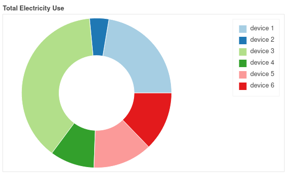
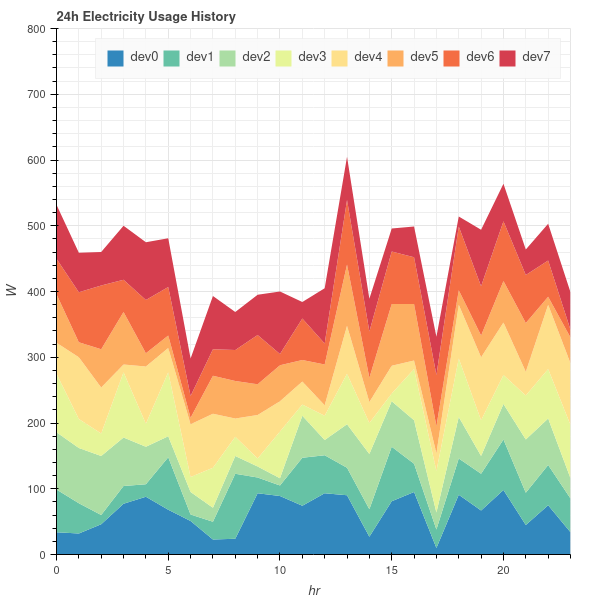
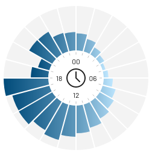

modules in this dir should all implement a `generate` function that returns a
string containing an html page

the webserver can then call `generate()` and serve fresh data from the db every
time

at the moment, `example/bokeh/stacked.py` is not included here but is planned

# plots

for all plots

# future plots

for each plug, a clock-like plot
